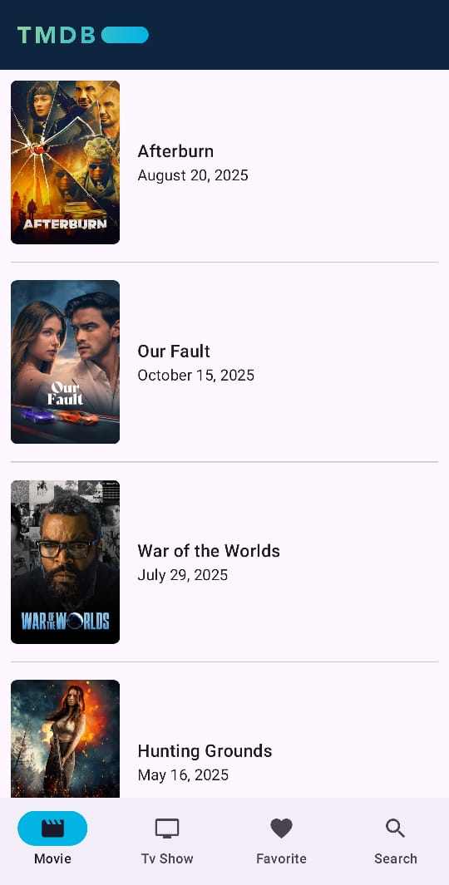
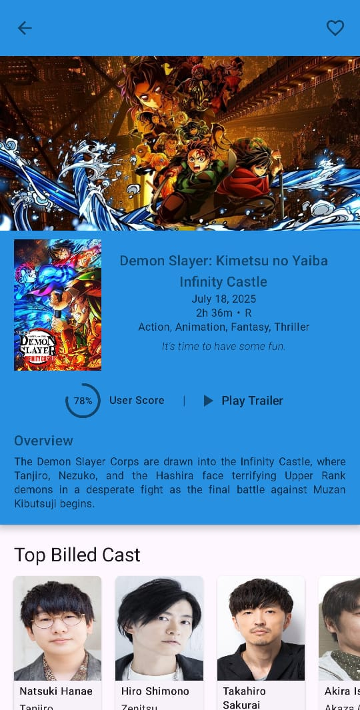
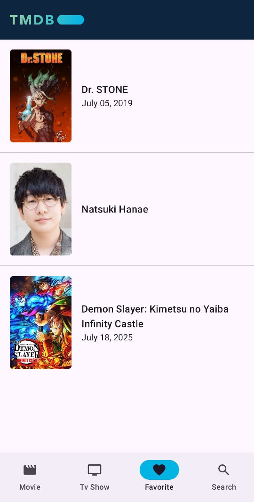
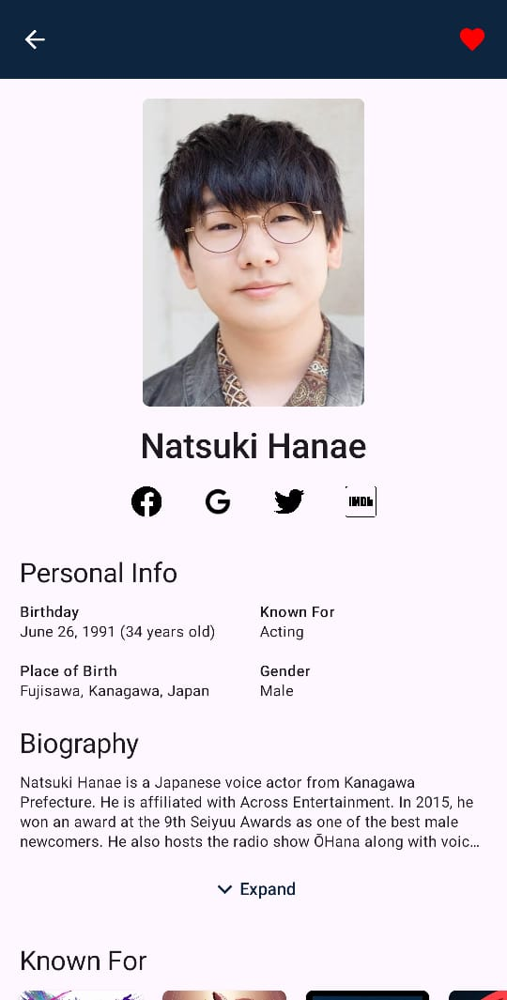

# TMDb App

This is an Android application for browsing Movies, TV Shows, and Persons using the [TMDb API](https://www.themoviedb.org/documentation/api). This app is built with Jetpack Compose and follows modern Android development practices.

## Features

*   **Browse Movies, TV Shows, and Persons**: Discover popular, top-rated, and trending content.
*   **Detailed Information**: View detailed information about movies, TV shows, and persons, including posters, titles, release dates, ratings, overviews, trailers, and cast.
*   **Dynamic UI**: The background color of the movie/TV show detail screen changes based on the poster image.
*   **Favorites**: Mark movies, TV shows, and persons as favorites to easily access them later.
*   **Search**: Search for your favorite movies, TV shows, and persons.

## Technologies Used

*   [Kotlin](https://kotlinlang.org/)
*   [Jetpack Compose](https://developer.android.com/jetpack/compose) for the UI
*   [Retrofit](https://square.github.io/retrofit/) for networking
*   [Koin](https://insert-koin.io/) for dependency injection
*   [Room](https://developer.android.com/training/data-storage/room) for local database
*   [Coil](https://coil-kt.github.io/coil/compose/) for image loading
*   [Paging 3](https://developer.android.com/topic/libraries/architecture/paging/v3-overview) for pagination
*   [Lottie](https://lottiefiles.com/plugins/android) for animations
*   [Firebase Crashlytics](https://firebase.google.com/docs/crashlytics) for crash reporting
*   [Firebase Analytics](https://firebase.google.com/docs/analytics) for analytics

## Screenshots

| Main Screen | Movie Detail | Favorite Screen | Person Detail |
| :---: | :---: | :---: | :---: |
|  |  |  |  |
